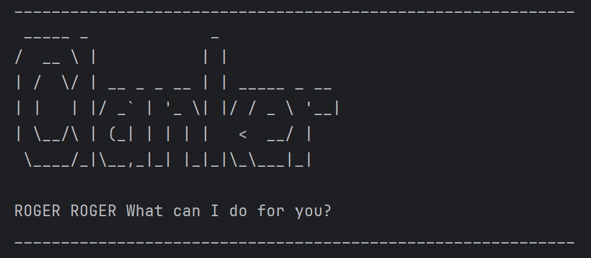

# Clanker User Guide




# **Clanker: Your Loyal Task-Handling Droid** 🤖✨
**_"Roger, Roger!"_** Your personal battle droid assistant has arrived!  
Clanker is a **command-line task manager** built to keep your missions on track—whether you're planning an invasion, dodging Jedi, or just managing deadlines.

## 🚀 Features

### 🔹 **Add Tasks Like a Tactical Commander**
Track **To-Do** Lists, schedule **Deadlines** and log critical **Events** with ease.

### 🔹 **Modify Orders on the Fly**
Mark, unmark, and delete tasks faster than a droid army deploying in battle.

### 🔹 **Precision Search**
Locate tasks by **description**, ensuring no mission detail goes unnoticed.

### 🔹 **Save Your Directives**
Store and load tasks via file, so even a memory wipe won’t erase your battle plans!

---  

Stay organized. Stay efficient. Stay in control.  
### **Deploy Clanker today!** 🚀

##  Command Guide

### 📌 Adding a To-Do Task
Create a simple to-do task with a description.

Command: `todo <description>`

#### **Example:**
```
todo Eliminate all Jedi
```
#### **Expected Output**
```plaintext 
ROGER ROGER Adding the following Todo: [T][ ] Eliminate All Jedi
Now you have 1 tasks in the list
```

### ⏳ Adding Deadlines
Create a simple deadline with a description by a certain deadline.

Command: `deadline <description> /by <deadline>`

#### **Example:**
```
deadline Eliminate all Jedi /by 01/04/2025 2359
```
#### **Expected Output**
```plaintext 
ROGER ROGER Adding the following Deadline: [D][ ] Eliminiate all Jedi  (by: 1/4/2025 2359)
Now you have 2 tasks in the list
```

### 📅  Adding Events
Create a simple event with a description from a certain time to another

Command: `event <description> /from <start> /to <end>`

#### **Example:**
```
event Eliminate all Jedi Younglings /from 01/04/2025 2359 /to 02/04/2025 2359
```
#### **Expected Output**
```plaintext 
ROGER ROGER Adding the following Event: [E][ ] Eliminate all Jedi  (from: 1/4/2025 2359 to: 2/4/2025 2359)
Now you have 3 tasks in the list
```
### 📜 List all Tasks
List all Tasks

#### **Command:**
```
ls
```
#### **Expected Output**
```plaintext 
ROGER ROGER Here are the tasks: 
1. [T][ ] Eliminate all Jedi
2. [D][ ] Eliminate all Jedi  (by: 1/4/2025 2359)
3. [E][ ] Eliminate all Jedi Younglings  (from: 1/4/2025 2359 to: 2/4/2025 2359)
```

### ✏️ Marking Task as Done/Not Done
Mark or Unmark Task as Done/Not Done

Command: `mark <task_number>` || `unmark <task_number>`

#### **Example:**
```
mark 1
```
#### **Expected Output**
```plaintext 
ROGER ROGER! This Task has been marked as done
[T][X] Elminate all Jedi
```

### ❌ Deleting a Task 
Delete a Task

Command: `mark <task_number>` || `unmark <task_number>`

#### **Example:**
```
delete 1
```
#### **Expected Output**
```plaintext 
ROGER ROGER! Deleting Task: 
[T][X] Elminate all Jedi
Now you have 2 tasks in the list
```
### 🔍 Finding a Tasks
List of Tasks with matching description

Command: `find <description>` 

#### **Example:**
```
find younglings
```
#### **Expected Output**
```plaintext 
ROGER ROGER! Here are the matching tasks:
3. [E][ ] Eliminate all Jedi Younglings  (from: 1/4/2025 2359 to: 2/4/2025 2359)
```

### 🔴 Exiting Clanker
Exit Clanker


#### **Command:**
```
blast-em
```

#### **Expected Output**
```plaintext 
ROGER ROGER! Hope to see you soon
```
